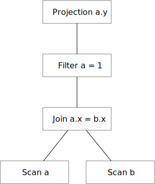
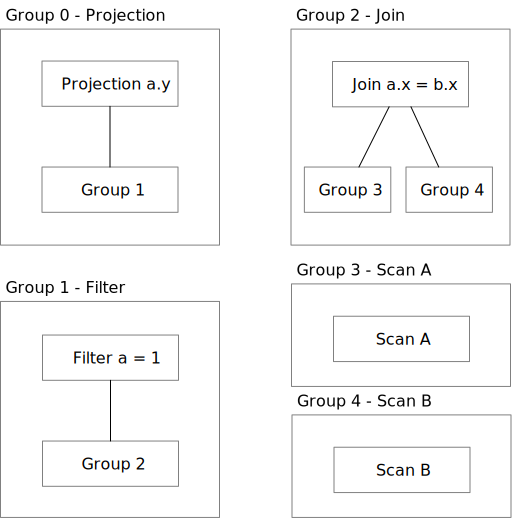
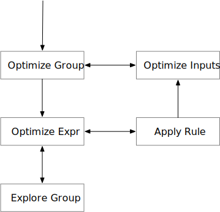
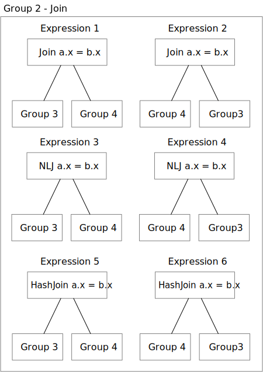

# Optimizer

optd implements the Columbia Cascades framework based on [Yongwen Xu's master's thesis](https://15721.courses.cs.cmu.edu/spring2019/papers/22-optimizer1/xu-columbia-thesis1998.pdf). The implementation can be found at `optd-core/src/cascades`.

In optd, the plan nodes are represented as a tree or DAG using the `RelNode` structure (we will explain this in [Plan Representation](./plan_repr.md)). For example, a join-filter-projection plan will be represented as:

The key idea of Cascades optimizer is to have a memo table that memorizes some information, so the the search process will not do the same search task twice. Therefore, inside the Cascades optimizer, the plan will be stored using `RelMemoNode` instead, where the children of a plan node will be stored as an integer id instead of the concrete plan nodes.

After storing the user-provided plan into the memo table using the memo representation, the optimizer will start the optimization process by invoking the Columbia Cascades tasks. The optimizer maintains ongoing tasks as a stack. Each task can invoke other tasks. The optimization process stops when all the stack becomes empty, or when it reaches the exploration budget. The task invocation graph is as below, as in the Columbia paper.

Here, `Group` corresponds to the `MExpr` in the Cascades paper, and `Expr` is simply `Expr` in the Cascades paper. An expression can be a plan node (i.e., join, projection) or an expression (as in projection, or filter condition). The task implementations can be found in `optd-core/src/cascades/tasks`. The apply rule task will invoke user-defined rules and produce new expressions in the group. The implementation of the rule engine can be found in [Rule Engine](./rule_engine.md). For example, after invoking the join reordering rule and the physical transformation rule, we will have the following expressions in the memo table group.

Note that we store physical expressions (i.e., NLJ/HashJoin) and logical expressions (i.e., Join) in the same group.

One special thing about the optd Cascades optimizer is that it persists states across runs. The states include: whether a rule is invoked or not, all the elements in the memo table, etc. The persistence property makes it possible for the optimizer to associate runtime information with the plan nodes, and use these runtime information in subsequent optimizations. You can learn more about adaptive optimization in optd in [Adaptive Optimization Overview](./adaptive_overview.md).

optd also provides a heuristics optimizer engine for testing rule implementation. It can be found at `optd-core/src/heuristics`.
