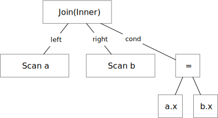

# Plan Representation

optd uses serialized representation of expressions internally. This makes it super easy to serialize the plans and handle the plans in a universal way. All plan nodes and SQL expressions are stored as `RelNode`. In contrast, systems like Apache Calcite use a object-oriented approach to define plan nodes.

*the optd representation -- one universal structure for all things*

```rust
pub struct RelNode {
    pub typ: Typ,
    pub children: Vec<RelNodeRef>,
    pub data: Option<Value>,
}

pub struct Join(RelNode);

impl Join {
    pub fn left(&self) -> PlanNode {
        PlanNode(self.0.child(0))
    }

    pub fn right(&self) -> PlanNode {
        PlanNode(self.0.child(1))
    }

    pub fn cond(&self) -> Expr {
        Expr(self.0.child(2))
    }

    pub fn join_type(&self) -> JoinType {
        let Typ::Join(typ) = self.0.typ { typ } else { unreachable!() }
    }
}
```

*the Calcite representation -- object-oriented*

```rust
pub struct Join {
    pub left: RelNode,
    pub right: RelNode,
    pub cond: Expression,
    pub join_type: JoinType,
}
```

The optd representation uses a universal type `RelNode` for all expressions, and therefore the optimizer framework can know everything inside the plan when processing. However, for the object-oriented representation, the user will likely need to implement some boilerplate functions like `replace_children` that facilitates the optimizer framework in the optimization process.

The downside of the optd representation is that more efforts are needed when getting things out of the plan node. For example, if the user wants to get the join condition, it will first extract the third child from the plan node, verify whether it is an expression by looking at the `typ` field, and then wrap it with the `Expr` class. Fortunately, optd provides a lot of macros to generate this kind of code, which can be found in the [optd Datafusion representation](./datafusion.md).

And because optd chooses to use a single representation for both plan nodes and SQL expressions, the actual representation of a join node contains a join condition as a direct child of the `RelNode` structure.



optd by default supports a Lisp-style display implementation for plan nodes. The above join plan will be printed as:

```
(Join(Inner) (Scan a) (Scan b) (= a.x b.x))
```

And users can implement other explain formats for plan nodes. For example, the optd Datafusion plan node representation implements the tree-style explain format for all plan nodes.

We still have not explained the `typ` field. It is a user-defined enum that contains all plan nodes in the system. For example, the `OptRelNodeTyp` enum, which is the Datafusion representation, contains logical plan nodes like `Projection`, `Join`; physical plan nodes like `NestedLoopJoin`; and expressions like `BinOp`. Besides, optd has one constraint on the enum: it should always contain a `Placeholder(usize)` variant and a `List` variant.
