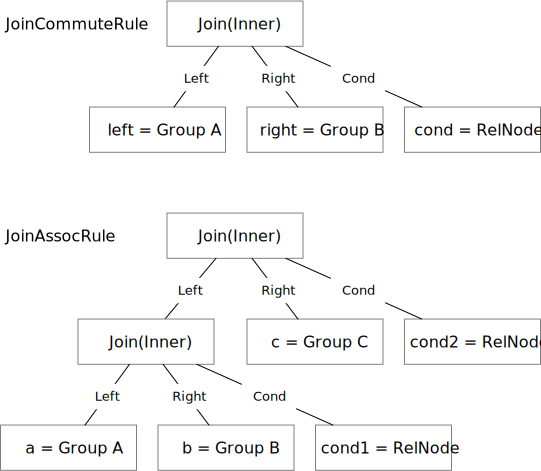
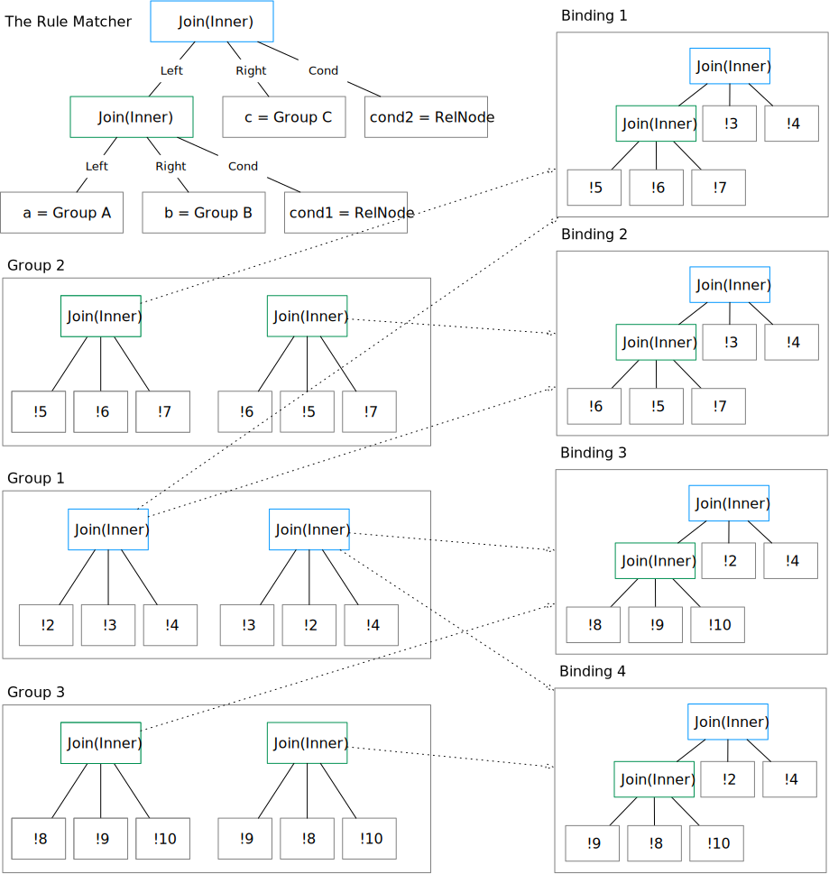

# Rules and Rule Engine

optd has a rule match engine based on Rust macros so that it is easier for developers to programmatically define a rule.

## Define a Rule Matcher

optd developers can define a rule by either implementing the `Rule` trait or use the helper macros. Both examples can be found under `optd-datafusion-repr/src/rules`.

```rust
// A join B -> B join A
define_rule!(
    JoinCommuteRule,
    apply_join_commute,
    (Join(JoinType::Inner), left, right, [cond])
);
```

Developers can use the `define_rule!` macro to define a rule by providing a rule matcher and a transformation function. As in the above `JoinCommuteRule` example, the rule matcher is `(Join(JoinType::Inner), left, right, [cond])`, which is a Lisp representation of the rule.

The join plan node in the optd Datafusion representation is: the `typ` field is `Join(JoinType)`, and the children are left child, right child, and the join condition. Therefore, this rule matches the inner join node, and retrieves left child, right child, and cond back.

```rust
// (A join B) join C -> A join (B join C)
define_rule!(
    JoinAssocRule,
    apply_join_assoc,
    (
        Join(JoinType::Inner),
        (Join(JoinType::Inner), a, b, [cond1]),
        c,
        [cond2]
    )
);
```

The above example is the join assoc rule. It matches a left-deep join tree. The following figure is the visual representation of the two matchers:



Note that variables like `a`, `b`, `c` will only match the group ID of a child, while `[cond1]` will expand the group IDs and retrieve the concrete expressions. `[xxx]` is useful when matching the SQL expression child.

The matcher API also supports get all children of a plan node, which is useful on processing projection expressions, but this is not supported in the matcher macro for now.

## Implement the Transformation

Once the optimizer matches a plan node in the plan space, it will invoke the `apply_join_commute` transformation function for the `JoinCommute` rule, or the `apply_join_assoc` function for the `JoinAssoc` rule. The transformation function takes two parameters: the optimizer instance, and the matched structure, where the structure is auto-generated by the macro containing all match variables defined by the user. For example, 

```rust
fn apply_join_assoc(
    optimizer: &impl Optimizer<OptRelNodeTyp>,
    JoinAssocRulePicks {
        a: RelNode<OptRelNodeTyp>,
        b: RelNode<OptRelNodeTyp>,
        c: RelNode<OptRelNodeTyp>,
        cond1: RelNode<OptRelNodeTyp>,
        cond2: RelNode<OptRelNodeTyp>,
    }: JoinAssocRulePicks,
) -> Vec<RelNode<OptRelNodeTyp>> {
    // do some processing and return the transformed plan node
}
```

Users can expect `a`, `b`, `c` to be a `OptRelNodeTyp::Placeholder` type as the optimizer will only return the group ID information, while `cond1` and `cond2` are concrete SQL expression trees.

## Generate Bindings

One crucial step in the Cascades apply rule step is to generate bindings for a rule. From the optimizer's perspective, it will only see `RelMemoNode` during the search process, which only contains the current node type and the children group IDs. It will need to recursively match the children so as to provide the rule transformation function a structure to process. For example, let us go through the example of applying the join assoc rule in the plan space.



As in the above figure, we first discover that two expressions in group 1 match the top-most node in the matcher. Therefore, it iterates all expressions and explore the child groups and matches the expressions in the child group with the child node in the matcher. Group 2 has two expressions that match the left side of the matcher, and group 3 also has two expressions satisfying the matcher requirement. Therefore, we have 4 bindings for this matcher in the plan space, and the rule transformation function will be invoked for 4 times for each of the bindings.

Currently, optd generates all bindings at once and invoke the rule transformation function for each of the bindings. This could be improved in the future that we have a `BindingsIterator` that generates one binding at a time.

## Rule Engine

### IR Representation

The rule engine matches the plan space based on a rule matcher IR defined in `optd-core/src/rules/ir.rs`. Currently, the IR contains 6 primitives that define the match pattern:

```rust
pub enum RuleMatcher<T: RelNodeTyp> {
    /// Match a node of type `typ`.
    MatchAndPickNode {
        typ: T,
        children: Vec<Self>,
        pick_to: usize,
    },
    /// Match a node of type `typ`.
    MatchNode { typ: T, children: Vec<Self> },
    /// Match anything,
    PickOne { pick_to: usize, expand: bool },
    /// Match all things in the group
    PickMany { pick_to: usize },
    /// Ignore one
    IgnoreOne,
    /// Ignore many
    IgnoreMany,
}
```

Specifically, `PickOne` and `PickMany` contain a `pick_to` field, which is an integer ID. The rule engine takes a matcher, matches the pattern, and return a `HashMap<usize, RelNode>` mapping, where the hash map key is the `pick_to` ID that the user provides. The integer ID must be unique in one matcher definition.

### Rule Definition Macro

The rule definition macro is a helper interface over the rule IR. It automatically generates the structure to store a matched pattern, generates the `pick_to` ID for each of the user-requested expression, and copies the content of the `HashMap` returned from the rule engine to the matched pattern structure.

For example, the macro for the join commute rule will be expanded into the following code:

```rust
impl JoinCommuteRule {
    pub fn new() -> Self {
        let mut pick_num = 0;
        let matcher = RuleMatcher::MatchNode {
            typ: Join(JoinType::Inner),
            children: vec![
                Box::new([
                    RuleMatcher::PickOne {
                        pick_to: {
                            let x = pick_num;
                            pick_num += 1;
                            x
                        },
                        expand: false,
                    },
                    // other picks
                ]),
            ],
        };
        Self { matcher }
    }
}
```

In `new`, the macro generates a matcher and maintains the counter for each of the `pick_to` field.

```rust
pub struct JoinCommuteRulePicks {
    pub left: RelNode<OptRelNodeTyp>,
    pub right: RelNode<OptRelNodeTyp>,
    pub cond: RelNode<OptRelNodeTyp>,
}
```

It then generates a structure to be passed to the rule transformation function with the user-defined variable names for each of the element in the match pattern.

In the `Rule` trait implementation, the macro generates the code to unpack elements from the hash map into the match pattern structure.

```rust
impl<O: Optimizer<OptRelNodeTyp>> Rule<OptRelNodeTyp, O> for JoinCommuteRule {
    fn apply(
        &self,
        optimizer: &O,
        mut input: HashMap<usize, RelNode<OptRelNodeTyp>>,
    ) -> Vec<RelNode<OptRelNodeTyp>> {
        let left: RelNode<OptRelNodeTyp>;
        let right: RelNode<OptRelNodeTyp>;
        let cond: RelNode<OptRelNodeTyp>;
        let mut pick_num = 0;
        {
            left = input.remove(&pick_num).unwrap();
            pick_num += 1;
        };
        // ...
        let res = JoinCommuteRulePicks { left, right, cond };
        apply_join_commute(optimizer, res)
    }
}
```
